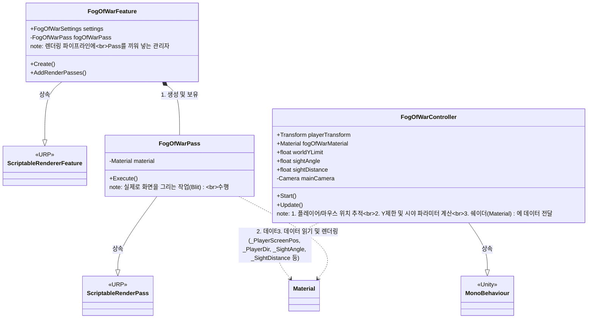
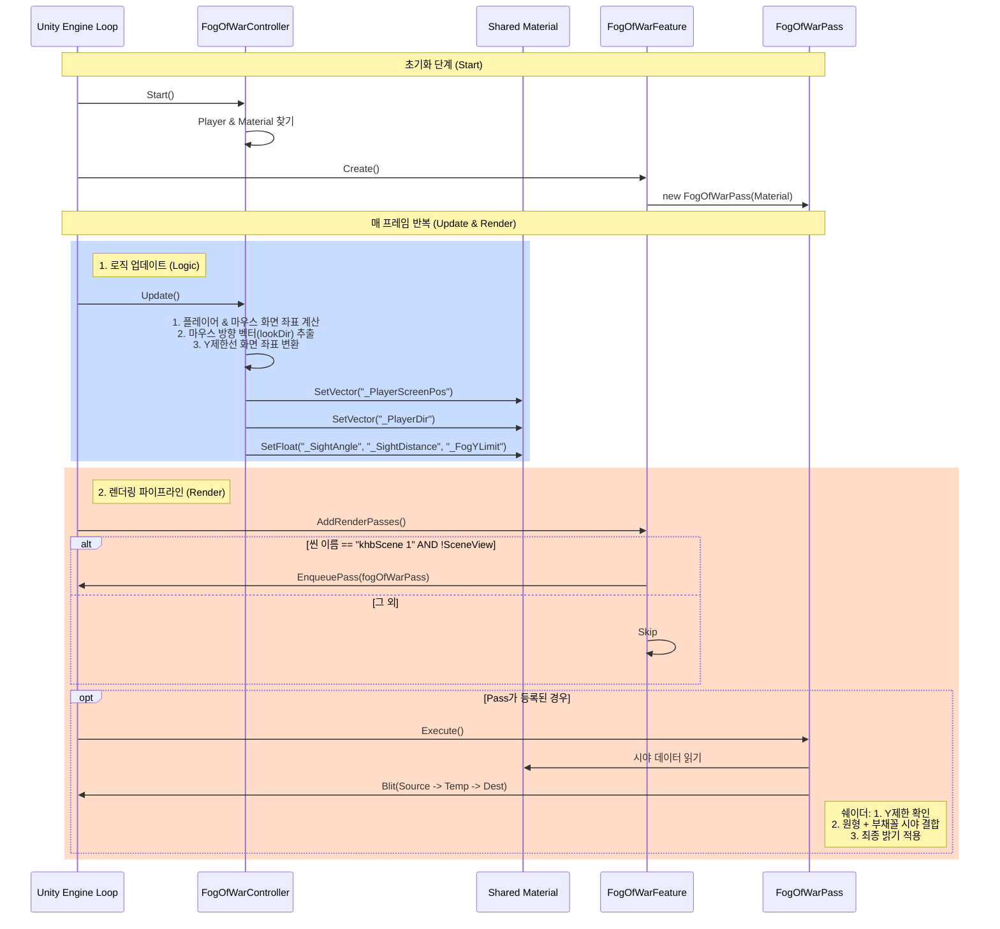

# Project Structure: Fog of War System

이 문서는 현재 프로젝트의 Fog of War(전장의 안개) 시스템 구조를 설명합니다.

## 1. Class Diagram (클래스 관계)

---

## 2. Sequence Diagram (실행 흐름)

## 3. 주요 렌더링 로직 (FogOfWar.shader)
안개 가시성(`visibility`)은 두 가지 시야의 합집합(MAX)으로 결정됩니다:

1.  **Base Circle Visibility (기본 원형)**
    -   플레이어 중심의 고정된 반지름(`_Radius`) 내를 밝힘.
    -   `visibilityA = 1.0 - smoothstep(_Radius, _Radius + _Softness, dist)`

2.  **Flashlight Cone Visibility (손전등 부채꼴)**
    -   마우스 방향(`_PlayerDir`)과 픽셀 방향의 내적(Dot Product)을 이용.
    -   설정된 각도(`_SightAngle`)와 사거리(`_SightDistance`) 내를 밝힘.
    -   `visibilityB = coneDistVisibility * angleVisibility`

3.  **Final Result**
    -   `visibility = max(visibilityA, visibilityB)`
    -   `Brightness = lerp(1.0 - _FogDarkness, 1.0, visibility)`
    -   Y좌표가 `_FogYLimit`보다 높으면 안개를 적용하지 않음.

---
## 확인 방법
1. VS Code에서 이 파일을 엽니다.
2. `Ctrl + Shift + V`를 누르거나 우측 상단의 **Open Preview** 버튼을 클릭합니다.
