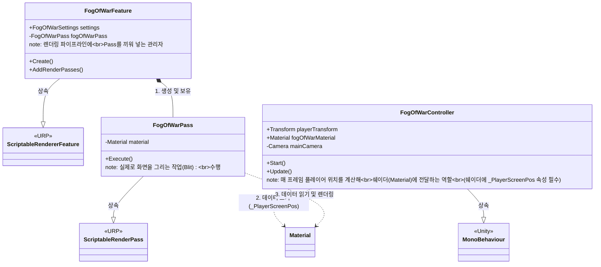
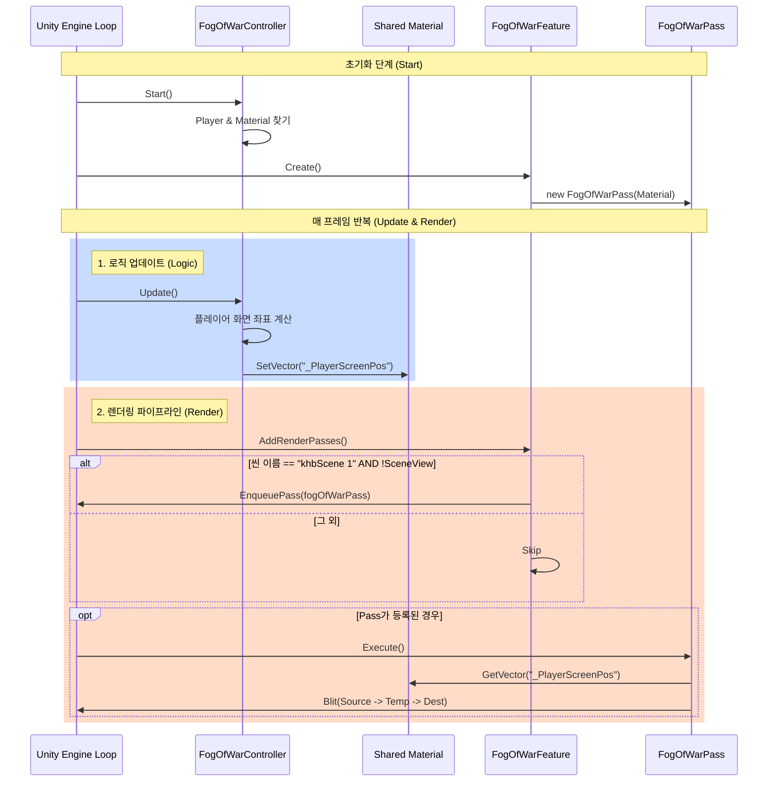
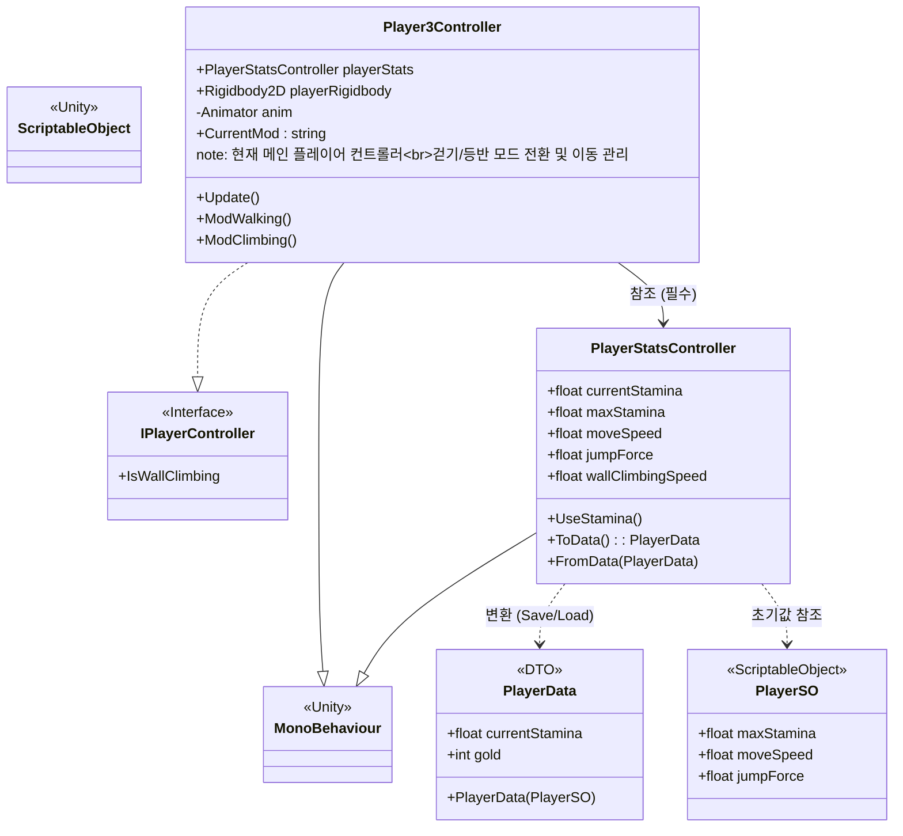
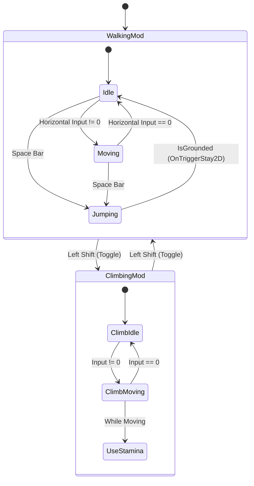

# Project Structure: Fog of War System
@tags: fog-of-war, architecture, project-structure, FieldOfView, PlayerVisionOverlay

이 문서는 현재 프로젝트의 Fog of War(전장의 안개) 시스템 구조를 설명합니다.

## 1. Class Diagram (클래스 관계)

---

## 2. Sequence Diagram (실행 흐름)

---

# Player System Structure

이 섹션은 플레이어의 조작, 상태 관리, 데이터 영속성 구조를 설명합니다.

## 1. Class Diagram (플레이어 구조)

## 2. Movement Mode Logic (플레이어 행동 모드)

플레이어의 움직임은 **CurrentMod** 변수와 **Shift** 키를 통한 모드 전환을 통해 관리됩니다.

## 확인 방법
1. VS Code에서 이 파일을 엽니다.
2. `Ctrl + Shift + V`를 누르거나 우측 상단의 **Open Preview** 버튼을 클릭합니다.