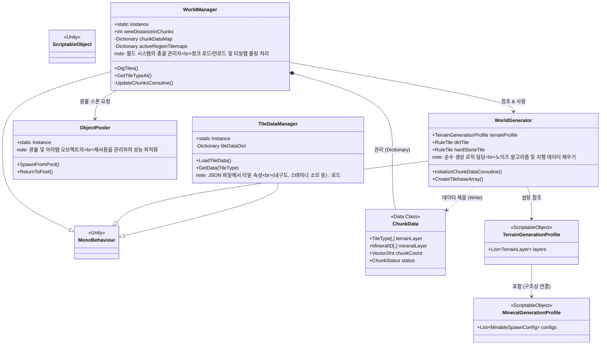
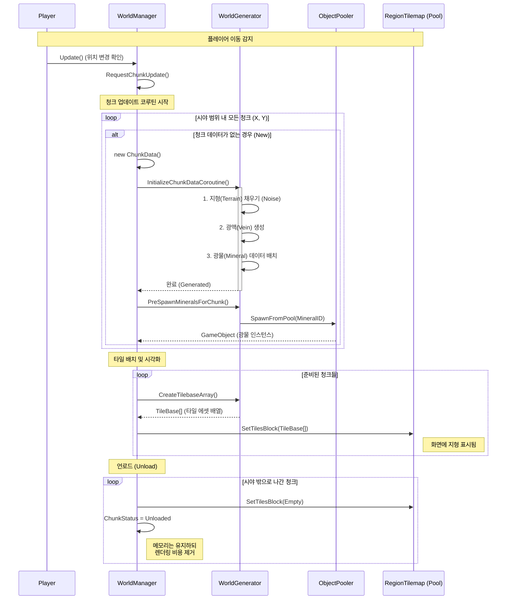

# World System Structure
@tags: world-system, architecture, chunk-lifecycle, InfinityMapManager, chunk-loading, overview

이 문서는 게임의 월드 생성, 청크 관리, 그리고 데이터 로딩 시스템의 구조를 설명합니다.

## 1. Class Diagram (월드 구조)

---

## 2. Sequence Diagram (청크 생성 및 로드 흐름)

플레이어가 이동할 때 새로운 청크가 생성되고 화면에 표시되는 과정을 나타냅니다.

## 3. 주요 데이터 흐름

1.  **설정 (Profile)**: `TerrainGenerationProfile`에서 층(Layer)별 깊이와 등장할 광물(`MineralGenerationProfile`)을 정의합니다.
2.  **생성 (Generator)**: `WorldGenerator`가 이 설정을 읽어 32x32 크기의 `ChunkData` 배열(Terrain, Mineral)을 채웁니다.
3.  **관리 (Manager)**: `WorldManager`는 이 데이터를 받아 실제 `Tilemap`에 타일을 깔고, 광물 위치에는 `ObjectPooler`를 통해 상호작용 가능한 오브젝트(Mineable)를 배치합니다.
4.  **속성 (Data)**: 채굴 시 필요한 타일의 내구도 정보는 `TileDataManager`가 `tileData.json`에서 불러와 제공합니다.

---

## 확인 방법
1. VS Code에서 이 파일을 엽니다.
2. `Ctrl + Shift + V`를 누르거나 우측 상단의 **Open Preview** 버튼을 클릭합니다.
