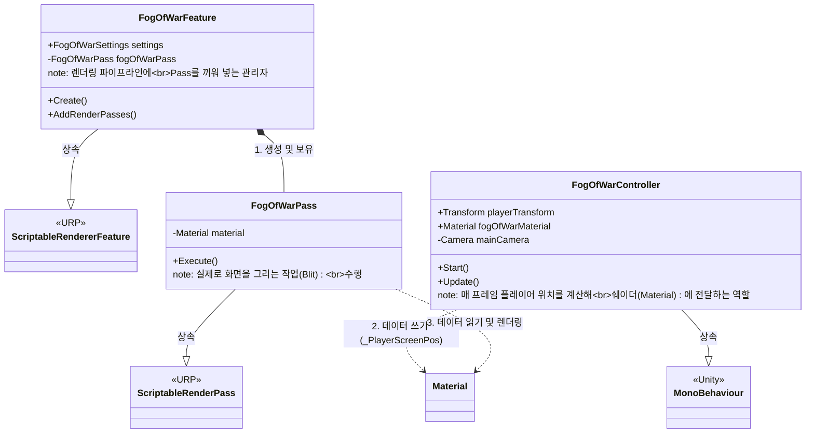
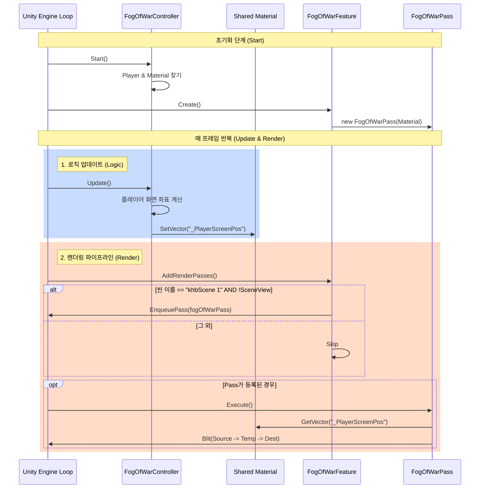

# Project Structure: Fog of War System

이 문서는 현재 프로젝트의 Fog of War(전장의 안개) 시스템 구조를 설명합니다.

## 1. Class Diagram (클래스 관계)

---

## 2. Sequence Diagram (실행 흐름)

## 확인 방법
1. VS Code에서 이 파일을 엽니다.
2. `Ctrl + Shift + V`를 누르거나 우측 상단의 **Open Preview** 버튼을 클릭합니다.
