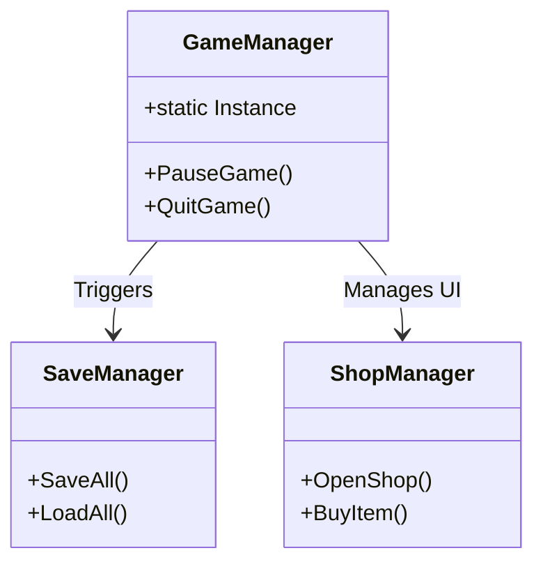
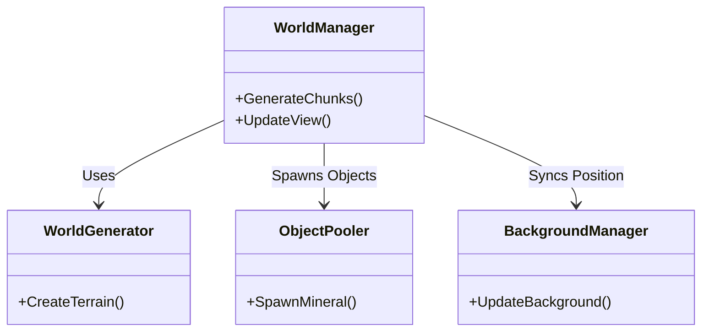
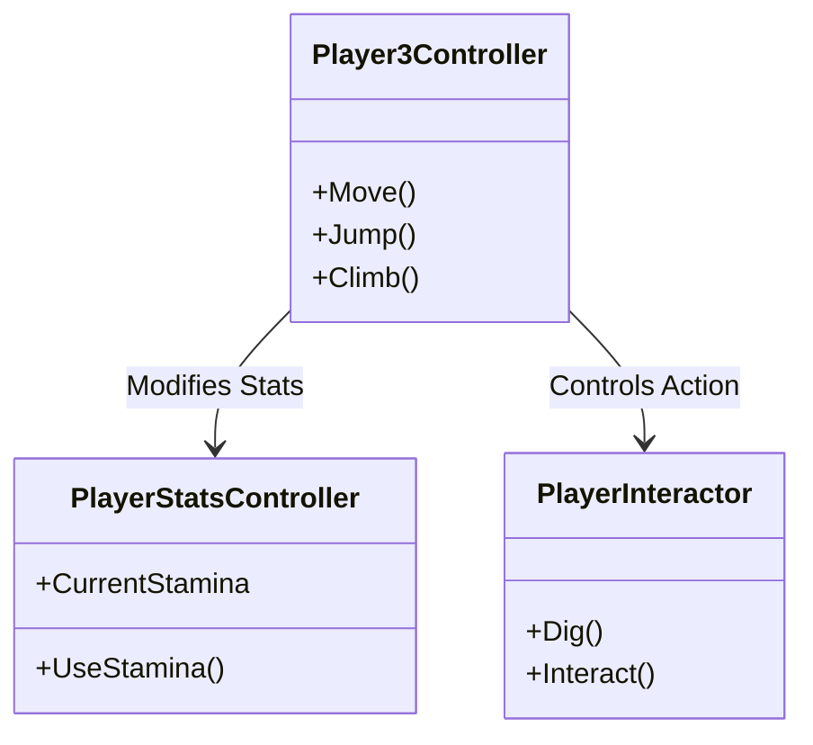
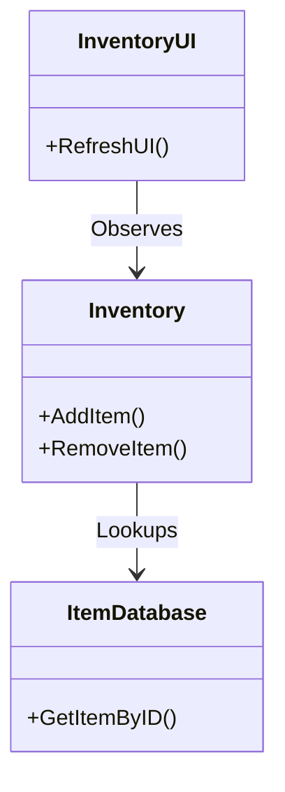

# Overall Script Architecture

이 문서는 프로젝트의 전체 스크립트 구조를 기능별로 분류하고, 각 모듈 간의 관계를 시각화합니다.

## 1. High-Level Module Architecture

프로젝트는 크게 4가지 핵심 모듈과 유틸리티로 구성됩니다.

```mermaid
graph TD
    %% Define Nodes
    Main[Main Managers]
    World[World System]
    Player[Player System]
    Inven[Inventory System]
    Util[Utils & Data]

    %% Relationships
    Main --> World : Save/Load World
    Main --> Player : Manage Game State
    Main --> Inven : Shop & Economy
    
    Player --> World : Interaction (Dig, Move)
    Player --> Inven : Add/Remove Items
    
    World --> Util : Use Enums & Constants
    Inven --> Util : Item Data & Databases
```

---

## 2. Module Details

### 2.1. Main Managers (Core Loop)
게임의 생명주기, 데이터 저장, 상점 등 전역적인 기능을 담당합니다.



### 2.2. World System (Environment)
지형 생성, 청크 관리, 광물 배치 등을 담당합니다.



### 2.3. Player System (Control & Stats)
플레이어의 입력 처리, 이동, 스탯(체력, 스태미나) 관리를 담당합니다.



### 2.4. Inventory System (Items & UI)
아이템 데이터, 인벤토리 UI, 장비 장착 등을 관리합니다.



---

## 3. Directory to Script Mapping

각 폴더별 주요 스크립트 목록입니다.

### 📁 MainManagers
- `GameManager.cs`: 게임 상태 관리
- `SaveManager.cs`: 데이터 저장/로드
- `ShopManager.cs`: 상점 기능

### 📁 World
- `WorldManager.cs`: 월드 총괄
- `WorldGenerator.cs`: 지형 생성 알고리즘
- `ObjectPooler.cs`: 오브젝트 풀링
- `TileDataManager.cs`: 타일 속성 관리

### 📁 Player
- `Player3Controller.cs`: 이동 및 상태 제어
- `PlayerStatsController.cs`: 스탯 관리
- `PlayerInteractor.cs`: 상호작용(채굴 등)

### 📁 Inventory
- `Inventory.cs`: 인벤토리 데이터 로직
- `InventoryUI.cs`: 인벤토리 화면 표시
- `ItemDatabase.cs`: 아이템 데이터 조회

### 📁 FogOfWar
- `FogOfWarController.cs`: 시야 로직
- `FogOfWarFeature.cs`: URP 렌더링 기능