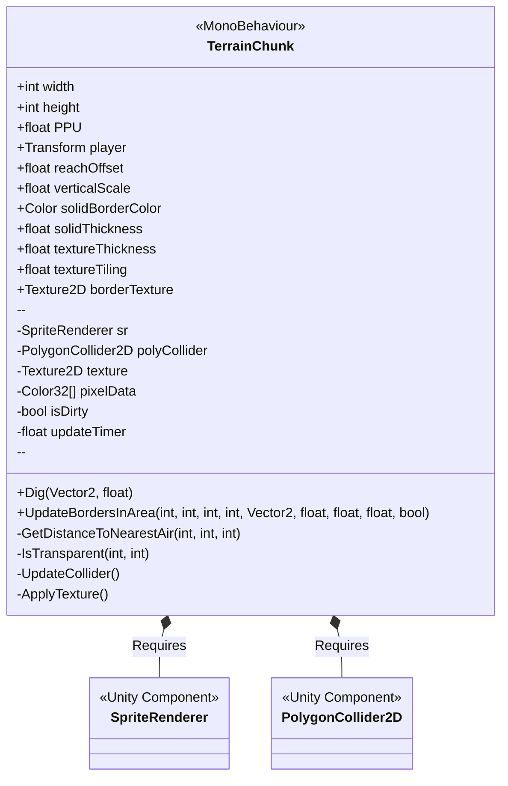
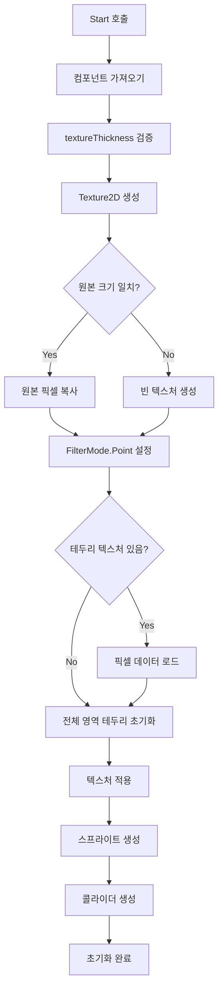
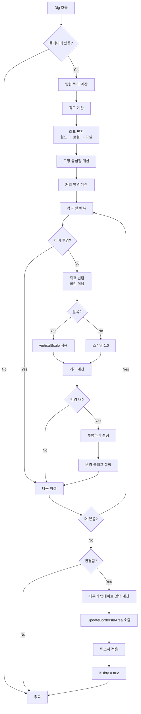
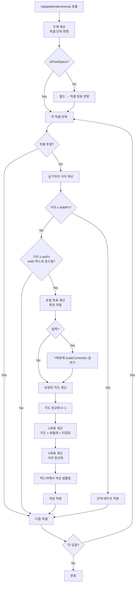
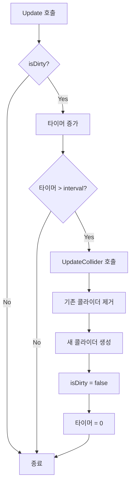

# TerrainChunk.cs Detail

`TerrainChunk.cs`는 픽셀 단위로 지형을 파괴하고 테두리를 그리는 컴포넌트입니다. 플레이어가 땅을 파는 동작을 처리하며, 타원형 구멍을 생성하고 테두리에 텍스처를 적용합니다.

## 1. Class Overview (클래스 구조)



## 2. 주요 변수 및 설정

### 2.1 기본 설정
- **`width`** (int, 기본값: 1000): 텍스처의 가로 픽셀 수
- **`height`** (int, 기본값: 1000): 텍스처의 세로 픽셀 수
- **`PPU`** (float, 기본값: 100f): Pixels Per Unit, 픽셀당 유니티 단위

### 2.2 플레이어 설정
- **`player`** (Transform): 플레이어의 Transform 참조
- **`reachOffset`** (float, 기본값: 1.0f): 플레이어로부터 구멍이 시작되는 거리 오프셋 (월드 단위)

### 2.3 땅파기 모양 설정
- **`verticalScale`** (float, 기본값: 1.5f): 앞쪽 방향의 수직 스케일. 값이 클수록 앞쪽이 더 길게 파괴됨 (타원형 구멍 생성)

### 2.4 테두리 설정
- **`solidBorderColor`** (Color, 기본값: 검은색): 단색 테두리의 색상
- **`solidThickness`** (float, 기본값: 0.05f): 단색 테두리의 두께 (월드 단위)
- **`textureThickness`** (float, 기본값: 0.3f): 텍스처 테두리의 두께 (월드 단위)
- **`textureTiling`** (float, 기본값: 0.8f): 텍스처 반복 빈도 (0.5 ~ 1.0 추천)
- **`borderTexture`** (Texture2D): 테두리에 사용할 텍스처 (Read/Write Enabled 필요)

### 2.5 내부 변수
- **`sr`**: SpriteRenderer 컴포넌트 참조
- **`polyCollider`**: PolygonCollider2D 컴포넌트 참조
- **`texture`**: 작업 중인 Texture2D
- **`pixelData`**: 픽셀 데이터 배열 (Color32[])
- **`isDirty`**: 콜라이더 업데이트 필요 여부
- **`updateTimer`**: 콜라이더 업데이트 타이머
- **`updateInterval`**: 콜라이더 업데이트 간격 (0.1초)

## 3. 함수별 상세 설명

### 3.1 `Start()` - 초기화

**위치**: 44-78줄

**역할**: 컴포넌트 초기화 및 텍스처 준비

**동작 과정**:
1. SpriteRenderer와 PolygonCollider2D 컴포넌트 가져오기
2. `textureThickness`가 `solidThickness`보다 큰지 확인 (최소값 보정)
3. 원본 스프라이트의 텍스처를 기반으로 새로운 Texture2D 생성
   - 크기가 같으면 원본 픽셀 데이터 복사
   - 크기가 다르면 빈 텍스처 생성
4. FilterMode를 Point로 설정 (픽셀 아트 스타일)
5. 픽셀 데이터 배열 초기화
6. 테두리 텍스처 로드 (Readable인 경우)
7. 전체 영역에 테두리 초기화
8. 텍스처 적용 및 스프라이트 생성
9. 콜라이더 초기 생성

**코드 참조**:
```44:78:Assets/Scripts/Tiles/TerrainChunk.cs
void Start()
{
    sr = GetComponent<SpriteRenderer>();
    polyCollider = GetComponent<PolygonCollider2D>();

    if (textureThickness <= solidThickness + 0.01f) textureThickness = solidThickness + 0.1f;

    Texture2D original = sr.sprite.texture;
    texture = new Texture2D(width, height, TextureFormat.RGBA32, false);
    texture.filterMode = FilterMode.Point;

    if (original.width == width && original.height == height)
        texture.SetPixels32(original.GetPixels32());
    else
        texture.SetPixels32(new Color32[width * height]);

    texture.Apply();
    pixelData = texture.GetPixels32();
    solidColor32 = (Color32)solidBorderColor;

    if (borderTexture != null && borderTexture.isReadable)
    {
        borderPixels = borderTexture.GetPixels32();
        borderW = borderTexture.width;
        borderH = borderTexture.height;
        isTextureLoaded = true;
    }

    // 초기화
    UpdateBordersInArea(0, 0, width, height, (player != null) ? (Vector2)player.position : Vector2.zero, 1.0f, 0.0f, 1.0f);
    ApplyTexture();

    sr.sprite = Sprite.Create(texture, new Rect(0, 0, width, height), new Vector2(0.5f, 0.5f), PPU);
    UpdateCollider();
}
```

### 3.2 `Update()` - 지연된 콜라이더 업데이트

**위치**: 80-92줄

**역할**: 변경 사항이 있을 때 일정 간격으로 콜라이더 업데이트

**동작 과정**:
1. `isDirty` 플래그 확인
2. 타이머가 `updateInterval`(0.1초)을 초과하면 콜라이더 업데이트
3. 플래그와 타이머 리셋

**설계 이유**: 콜라이더 재생성은 비용이 크므로, 여러 번의 변경을 한 번에 처리하기 위해 지연 업데이트 사용

**코드 참조**:
```80:92:Assets/Scripts/Tiles/TerrainChunk.cs
void Update()
{
    if (isDirty)
    {
        updateTimer += Time.deltaTime;
        if (updateTimer > updateInterval)
        {
            UpdateCollider();
            isDirty = false;
            updateTimer = 0f;
        }
    }
}
```

### 3.3 `ApplyTexture()` - 텍스처 적용

**위치**: 94-98줄

**역할**: 픽셀 데이터 배열을 Texture2D에 적용

**동작 과정**:
1. `pixelData` 배열을 텍스처에 설정
2. `Apply(false)` 호출로 GPU에 업로드 (mipmap 생성 안 함)

**코드 참조**:
```94:98:Assets/Scripts/Tiles/TerrainChunk.cs
void ApplyTexture()
{
    texture.SetPixels32(pixelData);
    texture.Apply(false);
}
```

### 3.4 `Dig()` - 지형 파괴

**위치**: 103-180줄

**역할**: 마우스 위치와 반경을 기반으로 타원형 구멍을 생성

**매개변수**:
- `mouseWorldPos` (Vector2): 마우스의 월드 좌표
- `radius` (float): 구멍의 반경 (월드 단위)

**동작 과정**:

1. **플레이어 위치 및 방향 계산**
   - 플레이어 위치에서 마우스로의 방향 벡터 계산
   - 각도 계산 (`Mathf.Atan2`)

2. **좌표 변환**
   - 월드 좌표를 로컬 좌표로 변환
   - 로컬 좌표를 픽셀 좌표로 변환
   - `reachOffset`을 픽셀 단위로 변환

3. **구멍 중심점 계산**
   - 플레이어 위치에서 방향 벡터로 `reachOffset`만큼 이동한 지점

4. **처리 영역 계산**
   - `verticalScale`을 고려한 최대 반경 계산
   - 마진을 포함한 처리 범위 결정

5. **타원형 구멍 생성**
   - 각 픽셀에 대해:
     - 플레이어 기준 로컬 좌표로 변환
     - 회전 변환 적용 (방향에 맞춤)
     - 앞쪽(`localX >= 0`)이면 `verticalScale` 적용, 뒤쪽이면 1.0
     - 스케일된 좌표로 거리 계산
     - 반경 내이면 투명하게 설정

6. **테두리 업데이트**
   - 변경된 영역 주변에 마진을 추가하여 테두리 업데이트 영역 계산
   - `UpdateBordersInArea()` 호출 (늘어짐 보정을 위해 `verticalScale` 전달)

7. **텍스처 적용 및 콜라이더 업데이트 예약**
   - `ApplyTexture()` 호출
   - `isDirty = true` 설정

**핵심 알고리즘 - 타원형 파괴**:
- 앞쪽 방향(`localX >= 0`)에서는 X축을 `verticalScale`로 나누어 타원형으로 만듦
- 뒤쪽 방향에서는 원형 유지
- 결과적으로 앞쪽이 더 길게 파괴되는 타원형 구멍 생성

**코드 참조**:
```103:180:Assets/Scripts/Tiles/TerrainChunk.cs
public void Dig(Vector2 mouseWorldPos, float radius)
{
    if (player == null) return;

    Vector2 playerPos = player.position;
    Vector2 direction = (mouseWorldPos - playerPos).normalized;
    float angle = Mathf.Atan2(direction.y, direction.x);

    float worldWidth = width / PPU;
    float worldHeight = height / PPU;

    Vector2 playerLocalPos = transform.InverseTransformPoint(playerPos);
    int playerPx = Mathf.FloorToInt((playerLocalPos.x + (worldWidth * 0.5f)) * PPU);
    int playerPy = Mathf.FloorToInt((playerLocalPos.y + (worldHeight * 0.5f)) * PPU);

    float reachOffsetPx = reachOffset * PPU;
    int r_holePx = Mathf.FloorToInt(radius * PPU);

    float cos = Mathf.Cos(-angle);
    float sin = Mathf.Sin(-angle);
    float frontScale = Mathf.Max(1f, verticalScale);

    int centerPx = playerPx + Mathf.FloorToInt(direction.x * reachOffsetPx);
    int centerPy = playerPy + Mathf.FloorToInt(direction.y * reachOffsetPx);

    int maxRadiusPx = Mathf.CeilToInt(r_holePx * frontScale);
    int margin = maxRadiusPx + 5;

    int minX = Mathf.Clamp(centerPx - margin, 0, width);
    int maxX = Mathf.Clamp(centerPx + margin, 0, width);
    int minY = Mathf.Clamp(centerPy - margin, 0, height);
    int maxY = Mathf.Clamp(centerPy + margin, 0, height);

    float sqrHolePx = r_holePx * r_holePx;
    bool pixelChanged = false;

    // 1. 구멍 뚫기
    for (int y = minY; y < maxY; y++)
    {
        float dy = y - playerPy;
        for (int x = minX; x < maxX; x++)
        {
            int index = y * width + x;
            if (pixelData[index].a == 0) continue;

            float dx = x - playerPx;
            float localX = dx * cos - dy * sin;
            float localY = dx * sin + dy * cos;
            localX -= reachOffsetPx;

            float currentScale = (localX >= 0) ? verticalScale : 1.0f;
            float localX_scaled = localX / currentScale;
            float distSqr = (localX_scaled * localX_scaled) + (localY * localY);

            if (distSqr <= sqrHolePx)
            {
                pixelData[index] = new Color32(0, 0, 0, 0);
                pixelChanged = true;
            }
        }
    }

    if (pixelChanged)
    {
        int updateMargin = Mathf.CeilToInt(textureThickness * PPU) + 20;

        int bMinX = Mathf.Clamp(minX - updateMargin, 0, width);
        int bMaxX = Mathf.Clamp(maxX + updateMargin, 0, width);
        int bMinY = Mathf.Clamp(minY - updateMargin, 0, height);
        int bMaxY = Mathf.Clamp(maxY + updateMargin, 0, height);

        // [중요] 늘어짐 보정을 위해 verticalScale 전달
        UpdateBordersInArea(bMinX, bMinY, bMaxX, bMaxY, new Vector2(centerPx, centerPy), cos, sin, verticalScale, true);

        ApplyTexture();
        isDirty = true;
    }
}
```

### 3.5 `UpdateBordersInArea()` - 테두리 업데이트

**위치**: 185-254줄

**역할**: 지정된 영역의 테두리를 그리며, 앞쪽 영역의 텍스처 늘어짐을 보정

**매개변수**:
- `minX`, `minY`, `maxX`, `maxY`: 업데이트할 영역 (픽셀 좌표)
- `pivotPos`: 기준점 위치 (월드 좌표 또는 픽셀 좌표)
- `cos`, `sin`: 회전 변환 값 (기본값: 1.0, 0.0)
- `scaleCorrection`: 스케일 보정 값 (기본값: 1.0)
- `isPixelSpace`: `pivotPos`가 픽셀 좌표인지 여부 (기본값: false)

**동작 과정**:

1. **두께 계산**
   - 단색 테두리 두께를 픽셀 단위로 변환
   - 텍스처 테두리 두께를 픽셀 단위로 변환
   - 두께 차이 계산

2. **기준점 좌표 변환**
   - `isPixelSpace`가 false면 월드 좌표를 픽셀 좌표로 변환

3. **각 픽셀 처리**
   - 투명한 픽셀은 건너뛰기
   - 가장 가까운 공기까지의 거리 계산 (`GetDistanceToNearestAir`)
   
4. **단색 테두리 적용**
   - 거리가 `solidPx` 이하면 단색 테두리 색상 적용

5. **텍스처 테두리 적용** (텍스처가 로드된 경우)
   - 거리가 `texPx` 이하이고 `solidPx` 초과인 경우
   - 회전 변환을 적용하여 로컬 좌표 계산
   - **늘어짐 보정**: 앞쪽(`localX > 0`)일 때 Y좌표에 `scaleCorrection` 곱하기
   - 보정된 각도 계산 (`Mathf.Atan2`)
   - 각도를 0~1 범위로 정규화
   - U좌표: 정규화된 각도 × 기준 원둘레 × 타일링 (텍스처 너비로 모듈로)
   - V좌표: 거리를 0~1로 정규화하여 텍스처 높이로 매핑
   - 텍스처에서 색상 샘플링 및 적용

**핵심 알고리즘 - 늘어짐 보정**:
- 앞쪽 영역에서 타원형으로 늘어난 만큼, Y좌표에 스케일을 곱해 각도를 빠르게 만듦
- 이렇게 하면 텍스처 좌표가 압축되어 시각적 늘어짐이 사라짐
- 예: `verticalScale = 1.5`일 때, 앞쪽의 Y좌표를 1.5배하면 각도가 더 빠르게 변하여 텍스처가 압축됨

**코드 참조**:
```185:254:Assets/Scripts/Tiles/TerrainChunk.cs
public void UpdateBordersInArea(int minX, int minY, int maxX, int maxY, Vector2 pivotPos,
                                float cos = 1f, float sin = 0f, float scaleCorrection = 1f,
                                bool isPixelSpace = false)
{
    int solidPx = Mathf.CeilToInt(solidThickness * PPU);
    int texPx = Mathf.CeilToInt(textureThickness * PPU);
    float thicknessDelta = Mathf.Max(1f, texPx - solidPx);

    int pX = (int)pivotPos.x;
    int pY = (int)pivotPos.y;
    if (!isPixelSpace)
    {
        Vector2 localPos = transform.InverseTransformPoint(pivotPos);
        pX = Mathf.FloorToInt((localPos.x + (width / PPU * 0.5f)) * PPU);
        pY = Mathf.FloorToInt((localPos.y + (height / PPU * 0.5f)) * PPU);
    }

    for (int y = minY; y < maxY; y++)
    {
        int yIndex = y * width;
        for (int x = minX; x < maxX; x++)
        {
            int index = yIndex + x;
            if (pixelData[index].a == 0) continue;

            int distToAir = GetDistanceToNearestAir(x, y, texPx);

            // 1. 단색 테두리
            if (distToAir <= solidPx)
            {
                pixelData[index] = solidColor32;
            }
            // 2. 이미지 테두리
            else if (distToAir <= texPx && isTextureLoaded)
            {
                float dx = x - pX;
                float dy = y - pY;

                // 회전된 로컬 좌표 (앞/뒤 구분용)
                float localX = dx * cos - dy * sin;
                float localY = dx * sin + dy * cos;

                // [늘어짐 해결 핵심]
                // 앞쪽(localX > 0)일 때는 Y좌표에 스케일을 곱해서 '각도를 빠르게' 만듭니다.
                // 이렇게 하면 타원이 길어진 만큼 텍스처 좌표도 압축되어 늘어짐이 사라집니다.
                float angleY = localY;
                if (localX > 0) angleY *= scaleCorrection;

                // 보정된 각도 계산
                float correctedAngle = Mathf.Atan2(angleY, localX);
                float normalizedAngle = (correctedAngle + Mathf.PI) / (2 * Mathf.PI);

                // U좌표: 보정된 각도 * 반지름 * 타일링
                // (반지름은 일정한 값을 곱해주면 텍스처 크기가 일정해집니다)
                // 여기서는 '텍스처 두께'를 기준 반지름으로 삼아 균일하게 만듭니다.
                float baseCircumference = texPx * 20f; // 임의의 기준 원둘레
                int u = Mathf.FloorToInt(normalizedAngle * baseCircumference * textureTiling) % borderW;
                if (u < 0) u += borderW;

                // V좌표: (1 - 거리) -> 거꾸로 매핑 (공기와 가까울수록 상단)
                float normalizedDist = (float)(distToAir - solidPx) / thicknessDelta;
                int v = Mathf.RoundToInt((1f - normalizedDist) * (borderH - 1));
                v = Mathf.Clamp(v, 0, borderH - 1);

                Color32 col = borderPixels[v * borderW + u];
                if (col.a > 20) pixelData[index] = col;
            }
        }
    }
}
```

### 3.6 `GetDistanceToNearestAir()` - 공기까지의 거리 계산

**위치**: 256-275줄

**역할**: 특정 픽셀에서 가장 가까운 투명 픽셀(공기)까지의 거리를 계산

**매개변수**:
- `cx`, `cy`: 중심 픽셀 좌표
- `maxCheck`: 최대 검사 거리

**동작 과정**:
1. 인접한 4방향 픽셀 확인 (거리 1)
2. 거리 2부터 `maxCheck`까지 반복:
   - 각 거리에서 사각형 경계를 따라 검사
   - 투명 픽셀을 찾으면 즉시 해당 거리 반환
3. `maxCheck` 내에서 찾지 못하면 `maxCheck + 1` 반환

**최적화**: 가장 가까운 거리부터 검사하여 조기 종료

**코드 참조**:
```256:275:Assets/Scripts/Tiles/TerrainChunk.cs
private int GetDistanceToNearestAir(int cx, int cy, int maxCheck)
{
    if (IsTransparent(cx + 1, cy) || IsTransparent(cx - 1, cy) ||
        IsTransparent(cx, cy + 1) || IsTransparent(cx, cy - 1)) return 1;

    for (int r = 2; r <= maxCheck; r++)
    {
        for (int x = cx - r; x <= cx + r; x++)
        {
            if (IsTransparent(x, cy + r)) return r;
            if (IsTransparent(x, cy - r)) return r;
        }
        for (int y = cy - r + 1; y <= cy + r - 1; y++)
        {
            if (IsTransparent(cx + r, y)) return r;
            if (IsTransparent(cx - r, y)) return r;
        }
    }
    return maxCheck + 1;
}
```

### 3.7 `IsTransparent()` - 투명도 체크

**위치**: 277-281줄

**역할**: 특정 픽셀이 투명한지 확인

**매개변수**:
- `x`, `y`: 픽셀 좌표

**동작 과정**:
1. 좌표가 범위를 벗어나면 `false` 반환 (경계 처리)
2. 픽셀의 알파 값이 0이면 `true` 반환

**코드 참조**:
```277:281:Assets/Scripts/Tiles/TerrainChunk.cs
private bool IsTransparent(int x, int y)
{
    if (x < 0 || x >= width || y < 0 || y >= height) return false;
    return pixelData[y * width + x].a == 0;
}
```

### 3.8 `UpdateCollider()` - 충돌체 재생성

**위치**: 283-287줄

**역할**: PolygonCollider2D를 재생성하여 변경된 지형에 맞춤

**동작 과정**:
1. 기존 PolygonCollider2D 제거
2. 새로운 PolygonCollider2D 추가
3. Unity가 자동으로 투명하지 않은 영역의 경계를 감지하여 콜라이더 생성

**주의사항**: 이 함수는 비용이 크므로 `Update()`에서 지연 업데이트로 처리됨

**코드 참조**:
```283:287:Assets/Scripts/Tiles/TerrainChunk.cs
void UpdateCollider()
{
    Destroy(polyCollider);
    polyCollider = gameObject.AddComponent<PolygonCollider2D>();
}
```

## 4. 동작 흐름

### 4.1 초기화 흐름



### 4.2 Dig 호출 시 전체 처리 흐름



### 4.3 테두리 업데이트 프로세스



### 4.4 콜라이더 업데이트 흐름



## 5. 핵심 알고리즘 상세 설명

### 5.1 타원형 파괴 메커니즘

타원형 파괴는 플레이어의 앞쪽 방향으로 더 길게 파괴되는 효과를 만듭니다.

**수학적 원리**:
1. 플레이어 위치를 기준으로 로컬 좌표계 설정
2. 마우스 방향으로 회전 변환 적용
3. 앞쪽(`localX >= 0`)에서는 X축을 `verticalScale`로 나눔
4. 거리 계산: `dist² = (localX/scale)² + localY²`

**예시**:
- `verticalScale = 1.5`, 반경 = 10픽셀
- 앞쪽: `localX = 15` → `localX_scaled = 10`, 거리 = 10 (구멍 내부)
- 뒤쪽: `localX = -10` → `localX_scaled = -10`, 거리 = 10 (구멍 내부)

결과적으로 앞쪽이 1.5배 더 길게 파괴됩니다.

### 5.2 좌표 변환 체인

좌표 변환은 다음과 같은 체인으로 이루어집니다:

```
월드 좌표 (World Space)
    ↓ InverseTransformPoint
로컬 좌표 (Local Space)
    ↓ (localPos + worldSize/2) × PPU
픽셀 좌표 (Pixel Space)
    ↓ 회전 변환 (cos, sin)
회전된 로컬 좌표 (Rotated Local)
    ↓ 스케일 적용 (앞/뒤 구분)
스케일된 좌표 (Scaled)
    ↓ 거리 계산
거리 값 (Distance)
```

**각 단계의 목적**:
- **월드 → 로컬**: TerrainChunk 오브젝트 기준 좌표
- **로컬 → 픽셀**: 텍스처 배열 인덱스
- **회전 변환**: 마우스 방향에 맞춤
- **스케일 적용**: 타원형 파괴

### 5.3 회전 변환

회전 변환은 2D 회전 행렬을 사용합니다:

```
[cos(θ)  -sin(θ)]   [x]
[sin(θ)   cos(θ)] × [y]
```

코드에서는 `-angle`을 사용하므로:
- `localX = dx × cos(-θ) - dy × sin(-θ)`
- `localY = dx × sin(-θ) + dy × cos(-θ)`

이렇게 하면 마우스 방향이 X축 양의 방향이 됩니다.

### 5.4 늘어짐 보정 알고리즘

타원형으로 파괴된 구멍의 테두리에 텍스처를 적용할 때, 앞쪽 영역에서 텍스처가 늘어 보이는 문제가 발생합니다.

**문제**:
- 앞쪽 영역이 타원형으로 늘어남
- 각도 기반 UV 매핑 시 텍스처도 함께 늘어남

**해결 방법**:
1. 앞쪽 영역(`localX > 0`)에서 Y좌표에 `scaleCorrection` 곱하기
2. 보정된 각도 계산: `angle = Atan2(angleY, localX)`
3. 이렇게 하면 각도가 더 빠르게 변하여 텍스처가 압축됨

**수학적 설명**:
- 원래: `angle = Atan2(localY, localX)`
- 보정: `angle = Atan2(localY × scaleCorrection, localX)`
- `scaleCorrection > 1`이면 각도가 더 크게 변하여 텍스처가 압축됨

**예시**:
- `scaleCorrection = 1.5`, `localX = 10`, `localY = 5`
- 원래 각도: `Atan2(5, 10) ≈ 0.464 rad`
- 보정 각도: `Atan2(7.5, 10) ≈ 0.643 rad`
- 각도가 더 크므로 텍스처가 더 빠르게 순환하여 압축 효과

## 6. 성능 고려사항

### 6.1 최적화 기법

1. **영역 제한**: 변경된 영역만 처리
2. **조기 종료**: 이미 투명한 픽셀은 건너뛰기
3. **지연 업데이트**: 콜라이더는 0.1초 간격으로 업데이트
4. **거리 계산 최적화**: 제곱 거리 비교 (제곱근 계산 생략)

### 6.2 주의사항

- **텍스처 크기**: 큰 텍스처는 메모리 사용량 증가
- **PPU 값**: 너무 크면 픽셀 단위가 작아져 성능 저하
- **테두리 두께**: 두꺼울수록 처리 시간 증가
- **콜라이더 업데이트**: 자주 호출되면 성능 저하

## 7. 사용 예시

```csharp
// TerrainChunk 컴포넌트가 있는 GameObject에서
TerrainChunk terrain = GetComponent<TerrainChunk>();

// 마우스 위치로 땅 파기
Vector2 mouseWorldPos = Camera.main.ScreenToWorldPoint(Input.mousePosition);
float digRadius = 0.5f; // 월드 단위
terrain.Dig(mouseWorldPos, digRadius);
```

## 8. 의존성

- **Unity Components**:
  - `SpriteRenderer`: 텍스처 렌더링
  - `PolygonCollider2D`: 충돌 감지
- **외부 참조**:
  - `player` Transform: 플레이어 위치
  - `borderTexture`: 테두리 텍스처 (선택적)

## 9. 관련 파일

- `Assets/Scripts/Tiles/TerrainChunk.cs`: 본 문서의 대상 파일
- `Assets/Scripts/Tiles/Digger.cs`: TerrainChunk를 사용하는 컴포넌트일 가능성

