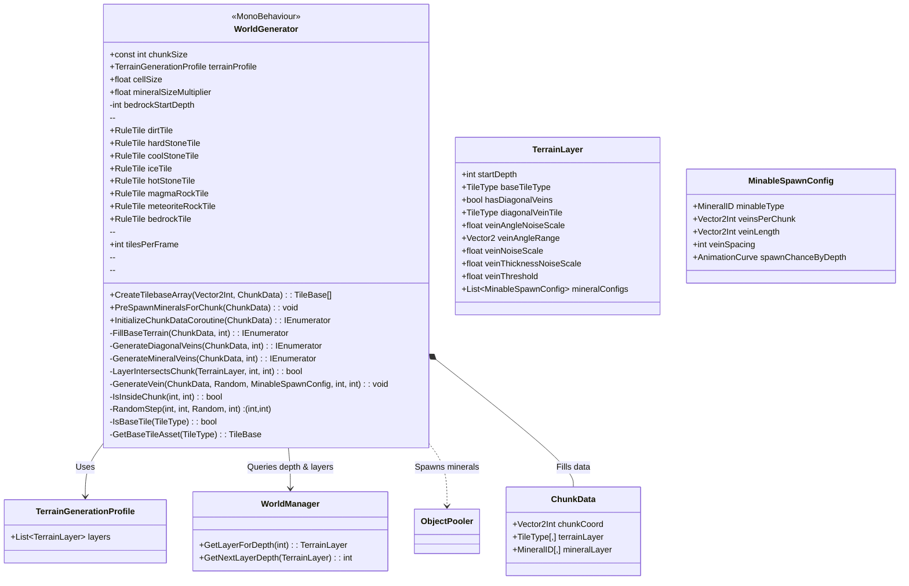
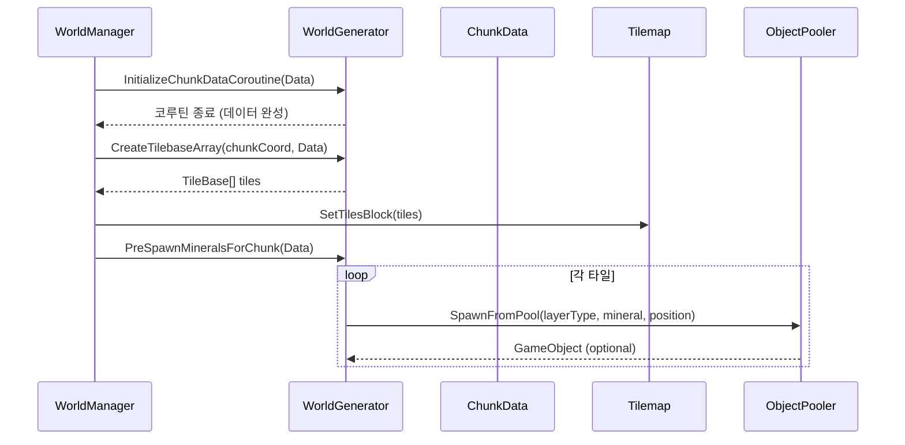

## WorldGenerator.cs Detail

`WorldGenerator.cs`는 **청크(Chunk) 단위 월드 지형과 광물 데이터를 실제로 생성하는 핵심 제네레이터 클래스**입니다.  
`WorldManager`가 청크를 관리·로드/언로드한다면, `WorldGenerator`는 그 청크 안의 **지형 타일 종류, 대각선 광맥, 광물 분포** 등을 규칙에 맞게 채워 넣는 역할을 합니다.

### 1. Class Overview (클래스 구조)



### 2. Key Logic Flow (핵심 동작 플로우)

#### 2.1 Start 초기화 & Bedrock 깊이 계산

1. `Start`에서 `terrainProfile`이 설정되어 있는지 확인합니다.
2. `terrainProfile.layers[6]`의 `startDepth` 값을 읽어서 `bedrockStartDepth`로 저장합니다.  
   - 이 값보다 깊은 Y(월드 좌표)는 `TileType.Bedrock`으로 강제로 설정됩니다.

이렇게 함으로써 **프로파일만 바꿔도 베드락 시작 깊이를 유연하게 조정**할 수 있습니다.

#### 2.2 Chunk 생성 전체 흐름

`WorldManager`가 새로운 청크를 생성할 때, 내부적으로 `InitializeChunkDataCoroutine`을 호출하여 다음 단계를 수행합니다.

```mermaid
flowchart TD
    A[InitializeChunkDataCoroutine(chunkData)] --> B[worldStartY 계산]
    B --> C[FillBaseTerrain]
    C --> D[GenerateDiagonalVeins]
    D --> E[GenerateMineralVeins]
    E --> F[완료 후 WorldManager가 CreateTilebaseArray / PreSpawnMineralsForChunk 호출]
```

- **1단계 `FillBaseTerrain`**  
  - 각 타일 좌표에 대해 `WorldManager.Instance.GetLayerForDepth(worldY)`를 호출해 적절한 `TerrainLayer`를 찾습니다.
  - 레이어가 있으면 그 레이어의 `baseTileType`을, 없으면 `TileType.Empty`(하늘 영역)를 설정합니다.
  - 이후 `worldY <= bedrockStartDepth` 조건이면 무조건 `TileType.Bedrock`으로 덮어씌워 베드락 층을 형성합니다.
  - 동시에 `mineralLayer[x, y]`는 모두 `MineralID.None`으로 초기화합니다.

- **2단계 `GenerateDiagonalVeins`**  
  - 각 타일에 대해 해당 깊이의 `TerrainLayer`를 다시 얻고, `hasDiagonalVeins`가 켜져 있는 레이어만 처리합니다.
  - 현재 타일이 그 레이어의 `baseTileType`과 일치할 때 `CheckDiagonalNoise`를 통해 대각선 광맥 패턴을 검사합니다.
  - 조건을 만족하면 `terrainLayer[x, y]`를 `layer.diagonalVeinTile`로 바꾸어 **지형 타일 자체를 광맥 타일로 변경**합니다.

- **3단계 `GenerateMineralVeins`**  
  - `terrainProfile.layers`를 순회하며, 각 레이어가 현재 청크의 Y 범위와 겹치는지(`LayerIntersectsChunk`) 판단합니다.
  - 레이어에 등록된 각 `MinableSpawnConfig`에 대해,  
    - 레이어 두께와 현재 청크의 상대 깊이로 **정규화된 깊이**를 계산하고,
    - `spawnChanceByDepth.Evaluate(...)`로 이 청크에서 해당 광물이 등장할 확률을 얻습니다.
  - 랜덤값이 `spawnChance`에 통과하면 `veinsPerChunk` 범위 안에서 실제 생성할 **광맥 개수(veinCount)**를 뽑습니다.
  - 각 광맥마다 랜덤 위치(startX, startY)에서 시작해 `GenerateVein`으로 **랜덤 워크(Random Walk)**를 수행하며 `mineralLayer`에 광물을 채워 넣습니다.

#### 2.3 타일 렌더링 & 광물 프리스폰

`WorldManager`는 데이터 생성이 끝난 후 다음 메서드를 사용합니다.



- **`CreateTilebaseArray`**:  
  - `terrainLayer` 2D 배열을 순회하면서, 각 `TileType`에 대응하는 `RuleTile`을 찾아 1D 배열(`TileBase[]`)로 변환합니다.
  - 이 배열은 `Tilemap.SetTilesBlock` 등에 사용되어 실제 화면에 지형 타일을 렌더링합니다.

- **`PreSpawnMineralsForChunk`**:  
  - `mineralLayer`를 순회하면서 `MineralID`가 `None`이 아닌 셀 위치에 대해,  
    - `WorldManager.Instance.GetLayerForDepth(worldY)`로 해당 깊이 레이어를 찾고,
    - `ObjectPooler.Instance.SpawnFromPool(layer.layerType, mineral, position, identity)` 호출로 광물 프리팹을 스폰합니다.
  - 스폰된 오브젝트는 `SetActive(true)`로 즉시 보이게 됩니다.

### 3. Detailed Method Analysis (주요 메서드 상세)

#### 3.1 Public API

- **CreateTilebaseArray(Vector2Int chunkCoord, ChunkData chunkData)**  
  - `chunkData.terrainLayer`를 기반으로 `TileBase[]`를 생성합니다.
  - `TileType` → `RuleTile` 매핑은 내부의 `GetBaseTileAsset`에서 처리합니다.
  - 단순히 지형만 시각화하고, 광물은 별도의 오브젝트로 스폰하기 때문에 `mineralLayer`는 이 단계에서 사용하지 않습니다.

- **PreSpawnMineralsForChunk(ChunkData chunkData)**  
  - 청크 좌표(`chunkCoord`)와 `chunkSize`를 이용해 각 셀의 월드 좌표를 계산합니다.
  - 해당 셀의 `MineralID`가 `None`이 아니면, 깊이에 맞는 `TerrainLayer`를 찾아 `ObjectPooler`를 통해 광물 오브젝트를 스폰합니다.
  - 이 함수는 **시각적인 광물 배치**를 담당하며, 실제 데이터는 여전히 `mineralLayer`에 남아 있습니다.

- **InitializeChunkDataCoroutine(ChunkData chunkData)**  
  - 청크 한 개의 **지형/광맥/광물 데이터를 비동기적으로 생성하는 메인 코루틴**입니다.
  - 내부적으로 `FillBaseTerrain → GenerateDiagonalVeins → GenerateMineralVeins` 순으로 실행합니다.
  - 각 단계가 끝날 때마다 `yield return null`을 사용해 한 프레임에 모든 연산을 몰지 않고, 프레임 드랍을 방지합니다.

#### 3.2 내부 지형 생성 메서드

- **FillBaseTerrain(ChunkData chunkData, int worldStartY)**  
  - 청크의 `(x, y)`를 순회하며 `worldY = worldStartY + y`를 계산합니다.
  - `WorldManager.Instance.GetLayerForDepth(worldY)`로 현재 깊이에 해당하는 레이어를 가져옵니다.
    - 레이어가 존재하면 `layer.baseTileType`, 없으면 `TileType.Empty`를 설정합니다.
  - `worldY <= bedrockStartDepth`면 `TileType.Bedrock`으로 강제 지정해 베드락 층을 만듭니다.
  - 모든 셀의 `mineralLayer[x, y]`를 `MineralID.None`으로 초기화합니다.

- **GenerateDiagonalVeins(ChunkData chunkData, int worldStartY)**  
  - 각 셀에 대해 다시 레이어를 조회하고, `layer.hasDiagonalVeins`가 `true`인 경우만 처리합니다.
  - 현재 셀의 `terrainLayer[x, y]`가 `layer.baseTileType`인 경우에만 `CheckDiagonalNoise`를 실행합니다.
  - `CheckDiagonalNoise` 결과가 `true`면 해당 셀을 `layer.diagonalVeinTile`로 변경하여 **레이어 내에 대각선 광맥 패턴**을 만듭니다.

- **CheckDiagonalNoise(Vector2Int chunkCoord, int x, int y, TerrainLayer layer)**  
  - 청크 기준 좌표를 월드 좌표 `(worldX, worldY)`로 변환합니다.
  - `PerlinNoise`를 사용해 각 좌표마다 **각도(angle)를 랜덤하게 부여**하고, 좌표를 회전시켜 대각선 방향성을 만듭니다.
  - 회전된 좌표에 대해 다시 노이즈를 샘플링하여 메인 노이즈(`mainNoise`)와 두께 노이즈(`thicknessNoise`)를 계산합니다.
  - `mainNoise - thicknessNoise > layer.veinThreshold` 조건을 만족하면 해당 셀을 광맥으로 간주합니다.

#### 3.3 내부 광물 생성 메서드

- **GenerateMineralVeins(ChunkData chunkData, int worldStartY)**  
  - 청크 좌표 기반으로 고정된 `System.Random` 시드(`chunkCoord.x * 10000 + chunkCoord.y`)를 사용해 **청크마다 일관된 결과**를 보장합니다.
  - `terrainProfile.layers`를 돌며, 각 레이어가 현재 청크 Y범위와 겹치는지 `LayerIntersectsChunk`로 판정합니다.
  - 레이어에 등록된 `mineralConfigs` 각각에 대해:
    - `WorldManager.Instance.GetNextLayerDepth(layer)`를 사용해 레이어 두께를 계산하고,
    - 현재 청크의 상대적인 깊이를 정규화해 `spawnChanceByDepth`에서 확률을 샘플링합니다.
    - 랜덤값이 이 확률보다 작으면 광맥 생성 로직에 진입하여 `veinsPerChunk` 범위 내에서 실제 광맥 개수를 결정합니다.
  - 각 광맥은 랜덤 시작점 `(startX, startY)`에서 `GenerateVein` 호출로 생성됩니다.

- **LayerIntersectsChunk(TerrainLayer layer, int chunkStart, int chunkEnd)**  
  - 레이어의 깊이 범위와 청크의 깊이 범위가 서로 완전히 분리되어 있는지 검사합니다.
  - 여기서 `WorldManager.Instance.GetNextLayerDepth(layer)`를 사용해 레이어의 끝 깊이를 얻습니다.
  - 분리되어 있지 않다면(즉, 어느 정도 겹친다면) `true`로 보고 해당 레이어의 광물 생성 로직을 수행합니다.

- **GenerateVein(ChunkData chunkData, Random rng, MinableSpawnConfig config, int startX, int startY)**  
  - `veinLength` 범위에서 광맥 길이를 랜덤으로 정합니다.
  - 현재 좌표가 청크 안에 있고(`IsInsideChunk`), `IsBaseTile(terrainLayer[x, y])`이며, 아직 광물이 없는 경우 `mineralLayer[x, y]`에 `config.minableType`을 기록합니다.
  - 이후 `RandomStep`으로 몇 칸 이동해 다음 셀을 선택하고, 이를 반복하여 **랜덤 워크 형태의 광맥**을 만듭니다.

- **IsInsideChunk(int x, int y)**  
  - `0 <= x < chunkSize`, `0 <= y < chunkSize`인지 검사합니다.

- **RandomStep(int x, int y, Random rng, int spacing)**  
  - 0~3 사이의 랜덤 방향을 선택(상/하/좌/우)하고, `spacing`만큼 그 방향으로 이동합니다.
  - 이 방식으로 광맥이 **한 방향으로 길게 뻗거나, 계단식으로 이동**하는 패턴을 자연스럽게 만듭니다.

#### 3.4 유틸리티 메서드

- **IsBaseTile(TileType type)**  
  - `TileType.Dirt`부터 `TileType.MeteoriteRock` 사이의 값인지 확인합니다.
  - 즉, 기본 지형 타일에 대해서만 광맥/광물 덮어쓰기를 허용하기 위한 필터입니다.

- **GetBaseTileAsset(TileType type)**  
  - `TileType` 열거형을 실제 `RuleTile` 에셋으로 매핑합니다.
  - 예: `TileType.Dirt -> dirtTile`, `TileType.Bedrock -> bedrockTile`, 기타는 `null`.
  - `CreateTilebaseArray`에서 호출되어 최종적으로 Tilemap에 그려질 타일 배열을 구성합니다.

### 4. Dependencies (연관 클래스/시스템)

- **WorldManager**  
  - `GetLayerForDepth(int)`와 `GetNextLayerDepth(TerrainLayer)`를 통해, 현재 깊이에 해당하는 레이어와 다음 레이어의 경계를 얻습니다.
  - 덕분에 `WorldGenerator`는 **깊이에 따른 레이어 정의를 직접 알 필요 없이** 월드 매니저에 질의만 하면 됩니다.

- **TerrainGenerationProfile / TerrainLayer**  
  - 지형/광맥/광물 분포에 대한 **디자인 의도(프로파일)**를 담고 있는 ScriptableObject입니다.
  - 레이어의 시작 깊이, 기본 타일, 대각선 광맥 설정, 광물 생성 설정 등이 모두 여기 정의됩니다.

- **ObjectPooler**  
  - `PreSpawnMineralsForChunk`에서 광물 오브젝트를 풀링 방식으로 스폰할 때 사용됩니다.
  - 런타임 중 빈번한 광물 생성/파괴로 인한 GC 및 성능 저하를 막기 위한 구조입니다.

- **TileType / MineralID 열거형**  
  - `terrainLayer`와 `mineralLayer`의 셀 값을 표현하는 열거형입니다.
  - 실제 속성(채굴 속도, 드롭 아이템 등)은 별도의 데이터 매니저(예: `TileDataManager`, `MineralDataManager`)를 통해 관리될 수 있습니다.

---

요약하자면, **`WorldManager`가 월드의 "언제/어디"를 담당한다면, `WorldGenerator`는 그 위치에 "어떤 지형/광물이 존재하는지"를 규칙적으로 채워 넣는 역할**을 합니다.  
`TerrainGenerationProfile`을 수정하는 것만으로도 전체 월드의 지형·광물 분포를 유연하게 조정할 수 있도록 설계되어 있습니다.


