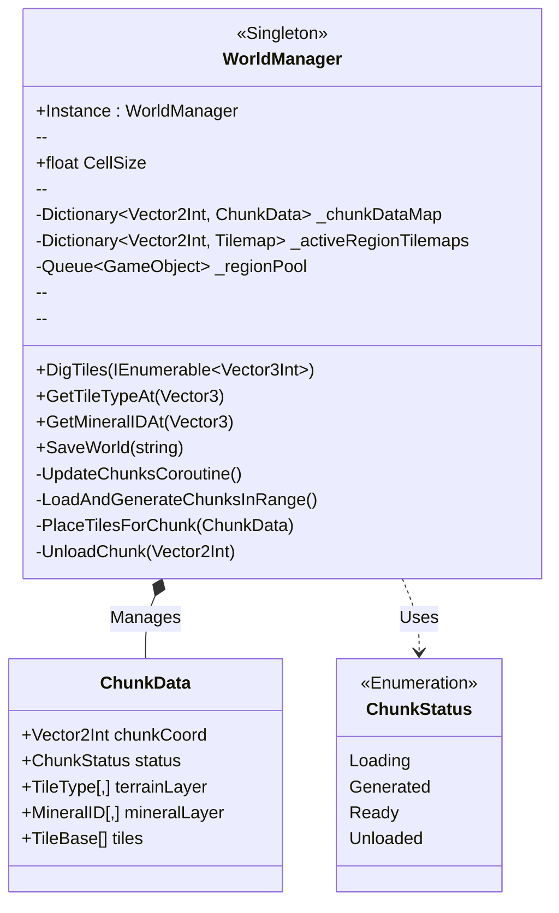
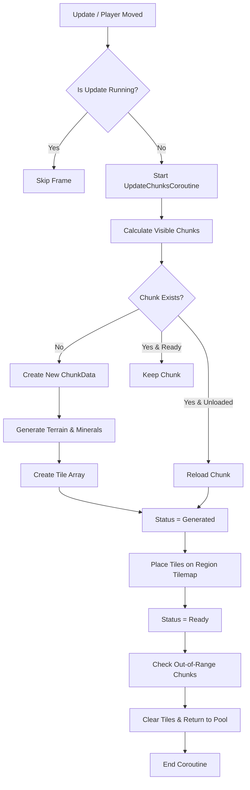
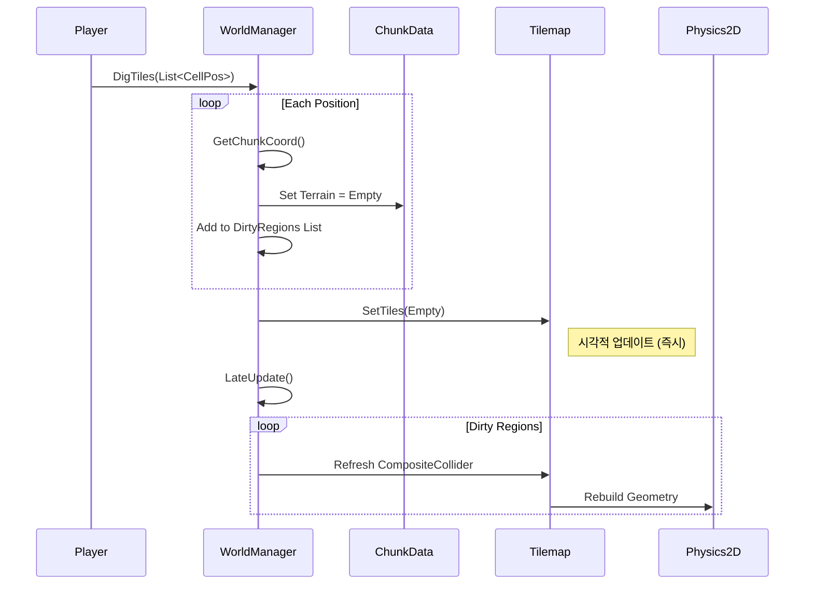

# WorldManager.cs Detail

`WorldManager.cs`는 게임의 무한 월드 시스템을 총괄하는 핵심 매니저 클래스입니다.
플레이어의 위치를 기반으로 주변 청크(Chunk)를 동적으로 로드/언로드하고, 타일맵 렌더링을 최적화하며, 채굴과 같은 월드 상호작용을 처리합니다.

## 1. Class Overview (클래스 구조)

## 2. Key Logic Flow (핵심 로직)

### 2.1 Chunk Update Loop (청크 업데이트)
플레이어가 이동할 때마다 호출되어 시야 범위 내의 청크를 로드하고, 벗어난 청크를 언로드합니다.

### 2.2 Digging Process (땅 파기)
플레이어가 타일을 파괴할 때의 처리 과정입니다. 성능을 위해 `LateUpdate`에서 콜라이더를 갱신합니다.

## 3. Detailed Field & Method Analysis

### 3.1 Region Pooling System
유니티의 Tilemap은 타일이 많아질수록 갱신 비용이 비싸집니다. 이를 해결하기 위해 **Region** 개념을 도입했습니다.
- **Region**: 여러 청크(기본 1x1)를 묶는 단위입니다.
- **Pooling**: `_regionPool` 큐를 사용하여 미리 생성된 Tilemap GameObject를 재사용합니다.
- **동작**: 청크가 로드될 때 `GetOrCreateRegionTilemap`으로 Region을 할당받고, 언로드될 때 `DecrementRegionChunkCount`를 통해 Region이 비게 되면 풀로 반환합니다.

### 3.2 Chunk Data Management
- `_chunkDataMap`: 생성된 모든 청크의 데이터를 메모리에 보관합니다. 언로드된 청크도 데이터는 유지되므로, 다시 돌아왔을 때 재생성 없이 렌더링만 다시 수행합니다.
- `SerializableWorldData`: 저장 시에는 이 맵의 데이터를 직렬화 가능한 형태로 변환하여 JSON으로 저장합니다.

### 3.3 Deferred Collider Generation
`DigTiles` 함수는 여러 타일을 한 번에 팔 때 호출됩니다.
- 타일 변경(`SetTiles`)은 즉시 일어나지만, 물리 연산 비용이 높은 `CompositeCollider2D` 갱신은 `_dirtyRegionColliders` 집합에 모아두었다가 매 프레임의 마지막(`LateUpdate`)에 한 번만 수행합니다.

## 4. Dependencies
- **WorldGenerator**: 실제 지형 데이터 생성을 위임합니다.
- **ObjectPooler**: 광물 오브젝트 생성을 위임합니다.
- **TileData (JSON)**: `TileType`은 `Enums.cs`에 정의되어 있지만, 실제 속성은 `TileDataManager`를 통해 로드됩니다.
